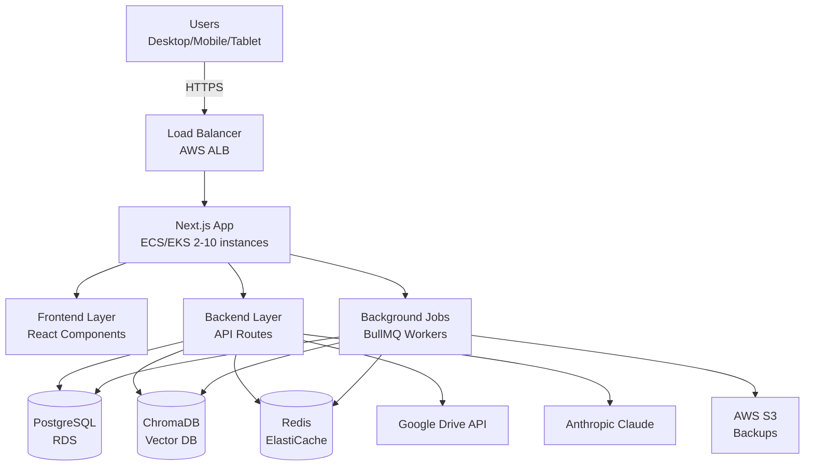
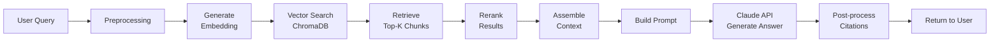
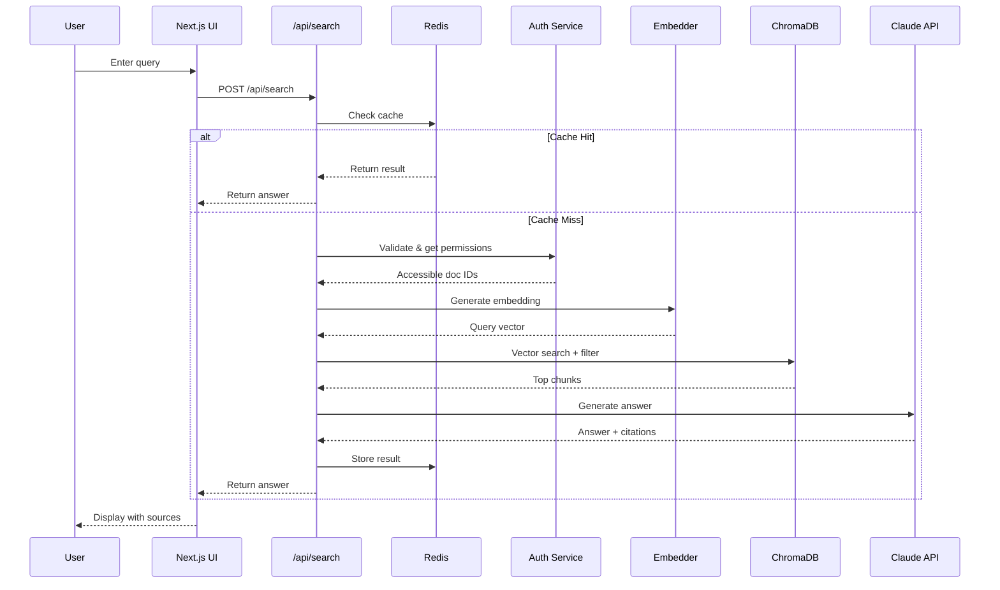
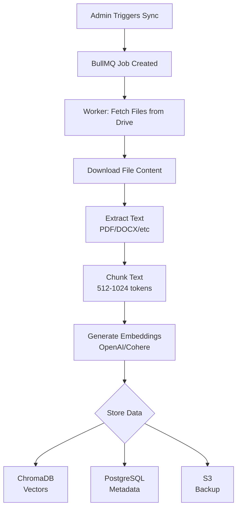
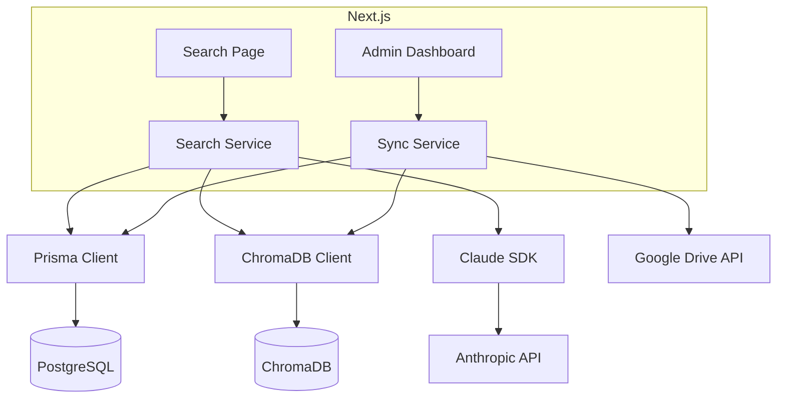
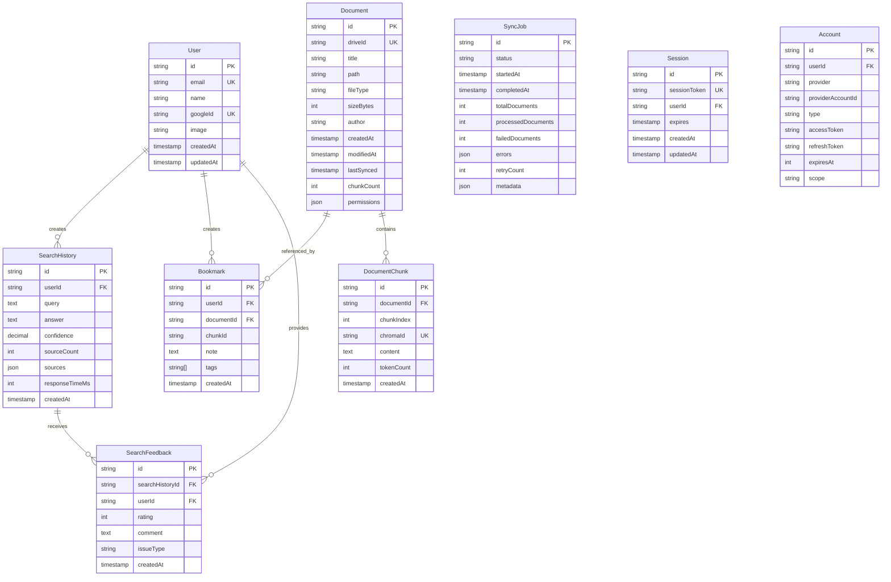

# RAG System Architecture

## High-Level System Architecture



---

## RAG Pipeline Flow



---

## Search Flow (Detailed)



---

## Document Ingestion Flow



---

## Component Interaction



---

## Tech Stack

| Layer | Technology | Purpose |
|-------|-----------|---------|
| **Frontend** | Next.js 14 + React | UI & Server Components |
| **UI** | Tailwind + shadcn/ui | Styling |
| **Backend** | Next.js API Routes | REST API |
| **ORM** | Prisma | Database layer |
| **Database** | PostgreSQL (RDS) | Metadata & users |
| **Vector DB** | ChromaDB | Embeddings |
| **Cache** | Redis (ElastiCache) | Cache + Queue |
| **LLM** | Claude 3.5 Sonnet | Answer generation |
| **Embeddings** | OpenAI/Cohere | Text vectors |
| **Storage** | AWS S3 | Backups |
| **Auth** | NextAuth.js | OAuth 2.0 |
| **Deploy** | AWS ECS/EKS | Containers |

---

## Security Layers

1. **Network**: VPC, Security Groups, HTTPS/TLS 1.3
2. **Application**: NextAuth OAuth, JWT, CSRF protection, Rate limiting
3. **Data**: Encryption at rest/transit, Permission inheritance
4. **API**: Secrets Manager, IAM roles, Input validation
5. **Audit**: CloudWatch logs, Access logs, Query logging

---

## Scalability

| Component | Current | Max | Strategy |
|-----------|---------|-----|----------|
| Next.js | 2-10 containers | 50+ | Horizontal (ECS) |
| PostgreSQL | Single | Multi-AZ | Vertical + Replicas |
| ChromaDB | Single | Clustered | Horizontal |
| Redis | Single node | Cluster | 3+ nodes |
| Workers | 2-5 | 20+ | Horizontal (BullMQ) |

---

## PostgreSQL Database Schema

### Entity Relationship Diagram



### Prisma Schema

```prisma
// prisma/schema.prisma

generator client {
  provider = "prisma-client-js"
}

datasource db {
  provider = "postgresql"
  url      = env("DATABASE_URL")
}

// User Management (NextAuth.js compatible)
model User {
  id            String    @id @default(cuid())
  email         String    @unique
  name          String?
  googleId      String?   @unique
  image         String?
  emailVerified DateTime?
  createdAt     DateTime  @default(now())
  updatedAt     DateTime  @updatedAt

  // Relations
  accounts       Account[]
  sessions       Session[]
  searchHistory  SearchHistory[]
  bookmarks      Bookmark[]
  searchFeedback SearchFeedback[]

  @@index([email])
  @@index([googleId])
}

model Account {
  id                String  @id @default(cuid())
  userId            String
  type              String
  provider          String
  providerAccountId String
  refresh_token     String? @db.Text
  access_token      String? @db.Text
  expires_at        Int?
  token_type        String?
  scope             String?
  id_token          String? @db.Text
  session_state     String?

  user User @relation(fields: [userId], references: [id], onDelete: Cascade)

  @@unique([provider, providerAccountId])
  @@index([userId])
}

model Session {
  id           String   @id @default(cuid())
  sessionToken String   @unique
  userId       String
  expires      DateTime
  createdAt    DateTime @default(now())
  updatedAt    DateTime @updatedAt

  user User @relation(fields: [userId], references: [id], onDelete: Cascade)

  @@index([userId])
  @@index([expires])
}

// Document Management
model Document {
  id          String   @id @default(cuid())
  driveId     String   @unique
  title       String
  path        String
  fileType    String
  sizeBytes   Int
  author      String?
  createdAt   DateTime
  modifiedAt  DateTime
  lastSynced  DateTime @default(now())
  chunkCount  Int      @default(0)
  permissions Json     // Store Google Drive permissions as JSON

  // Relations
  chunks    DocumentChunk[]
  bookmarks Bookmark[]

  @@index([driveId])
  @@index([lastSynced])
  @@index([fileType])
  @@index([author])
}

model DocumentChunk {
  id         String   @id @default(cuid())
  documentId String
  chunkIndex Int
  chromaId   String   @unique // ChromaDB vector ID
  content    String   @db.Text
  tokenCount Int
  createdAt  DateTime @default(now())

  document Document @relation(fields: [documentId], references: [id], onDelete: Cascade)

  @@unique([documentId, chunkIndex])
  @@index([chromaId])
  @@index([documentId])
}

// Search & Analytics
model SearchHistory {
  id             String   @id @default(cuid())
  userId         String
  query          String   @db.Text
  answer         String?  @db.Text
  confidence     Decimal? @db.Decimal(3, 2)
  sourceCount    Int      @default(0)
  sources        Json?    // Array of source documents
  responseTimeMs Int?
  createdAt      DateTime @default(now())

  user     User             @relation(fields: [userId], references: [id], onDelete: Cascade)
  feedback SearchFeedback[]

  @@index([userId, createdAt(sort: Desc)])
  @@index([createdAt(sort: Desc)])
}

model Bookmark {
  id         String   @id @default(cuid())
  userId     String
  documentId String
  chunkId    String?
  note       String?  @db.Text
  tags       String[] // PostgreSQL array type
  createdAt  DateTime @default(now())

  user     User     @relation(fields: [userId], references: [id], onDelete: Cascade)
  document Document @relation(fields: [documentId], references: [id], onDelete: Cascade)

  @@unique([userId, documentId, chunkId])
  @@index([userId, createdAt(sort: Desc)])
  @@index([documentId])
}

model SearchFeedback {
  id              String   @id @default(cuid())
  searchHistoryId String
  userId          String
  rating          Int // 1-5 stars
  comment         String?  @db.Text
  issueType       String? // irrelevant, incorrect, incomplete, other
  createdAt       DateTime @default(now())

  searchHistory SearchHistory @relation(fields: [searchHistoryId], references: [id], onDelete: Cascade)
  user          User          @relation(fields: [userId], references: [id], onDelete: Cascade)

  @@index([searchHistoryId])
  @@index([userId])
  @@index([createdAt(sort: Desc)])
}

// Background Jobs
model SyncJob {
  id                  String    @id @default(cuid())
  status              String // pending, running, completed, failed
  startedAt           DateTime?
  completedAt         DateTime?
  totalDocuments      Int       @default(0)
  processedDocuments  Int       @default(0)
  failedDocuments     Int       @default(0)
  errors              Json? // Array of error objects
  retryCount          Int       @default(0)
  metadata            Json? // Additional job metadata
  createdAt           DateTime  @default(now())
  updatedAt           DateTime  @updatedAt

  @@index([status])
  @@index([createdAt(sort: Desc)])
}
```

### Table Descriptions

| Table | Purpose | Key Features |
|-------|---------|--------------|
| **User** | User accounts | NextAuth.js compatible, Google OAuth |
| **Account** | OAuth provider data | Stores access/refresh tokens |
| **Session** | User sessions | JWT session management |
| **Document** | Document metadata | Maps to Google Drive files |
| **DocumentChunk** | Text chunks | Links to ChromaDB vectors |
| **SearchHistory** | Search logs | Analytics & user history |
| **Bookmark** | User bookmarks | Saved documents/chunks |
| **SearchFeedback** | User ratings | Quality improvement data |
| **SyncJob** | Background jobs | Sync status tracking |

### Indexes Strategy

**High Performance Indexes:**
```sql
-- User lookups
CREATE INDEX idx_user_email ON "User"(email);
CREATE INDEX idx_user_googleId ON "User"("googleId");

-- Document queries
CREATE INDEX idx_document_driveId ON "Document"("driveId");
CREATE INDEX idx_document_lastSynced ON "Document"("lastSynced");
CREATE INDEX idx_document_fileType ON "Document"("fileType");

-- Search history (most recent first)
CREATE INDEX idx_search_history_user_date ON "SearchHistory"("userId", "createdAt" DESC);
CREATE INDEX idx_search_history_date ON "SearchHistory"("createdAt" DESC);

-- Chunk lookups
CREATE INDEX idx_chunk_chromaId ON "DocumentChunk"("chromaId");
CREATE INDEX idx_chunk_document ON "DocumentChunk"("documentId");

-- Bookmarks
CREATE INDEX idx_bookmark_user_date ON "Bookmark"("userId", "createdAt" DESC);

-- Sync jobs
CREATE INDEX idx_sync_job_status ON "SyncJob"(status);
```

### Sample Queries

**Get user's recent searches:**
```sql
SELECT
  sh.id,
  sh.query,
  sh.answer,
  sh.confidence,
  sh.sourceCount,
  sh.createdAt,
  COUNT(sf.id) as feedback_count,
  AVG(sf.rating) as avg_rating
FROM "SearchHistory" sh
LEFT JOIN "SearchFeedback" sf ON sf."searchHistoryId" = sh.id
WHERE sh."userId" = $1
GROUP BY sh.id
ORDER BY sh."createdAt" DESC
LIMIT 20;
```

**Get document with chunks:**
```sql
SELECT
  d.*,
  json_agg(
    json_build_object(
      'id', dc.id,
      'chunkIndex', dc."chunkIndex",
      'chromaId', dc."chromaId",
      'tokenCount', dc."tokenCount"
    ) ORDER BY dc."chunkIndex"
  ) as chunks
FROM "Document" d
LEFT JOIN "DocumentChunk" dc ON dc."documentId" = d.id
WHERE d."driveId" = $1
GROUP BY d.id;
```

**Sync job statistics:**
```sql
SELECT
  status,
  COUNT(*) as job_count,
  AVG("processedDocuments") as avg_processed,
  AVG(EXTRACT(EPOCH FROM ("completedAt" - "startedAt"))) as avg_duration_seconds
FROM "SyncJob"
WHERE "startedAt" IS NOT NULL
GROUP BY status;
```

---

## Folder Structure

```
app/
├── api/
│   ├── search/route.ts
│   ├── documents/route.ts
│   ├── sync/trigger/route.ts
│   └── auth/[...nextauth]/route.ts
├── (dashboard)/
│   ├── search/page.tsx
│   └── history/page.tsx
└── (admin)/
    └── dashboard/page.tsx

lib/
├── prisma.ts
├── chromadb.ts
├── claude.ts
└── queue.ts

services/
├── ingestion/
│   ├── fetcher.ts
│   ├── chunker.ts
│   └── embedder.ts
└── search/
    ├── retriever.ts
    └── answer-generator.ts

workers/
└── sync.worker.ts

prisma/
└── schema.prisma
```
