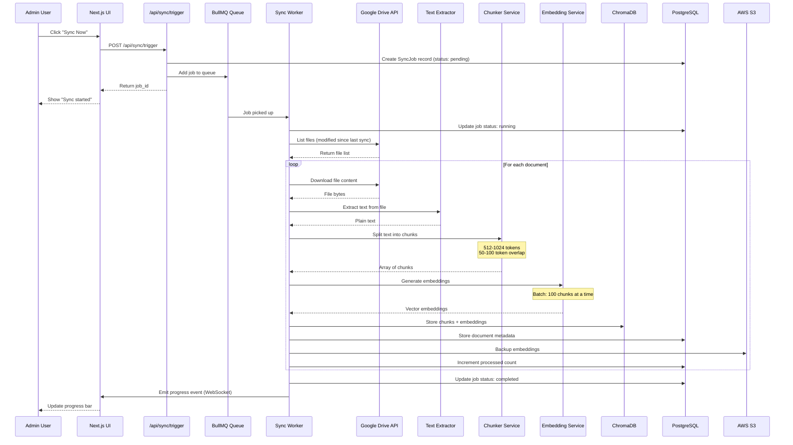
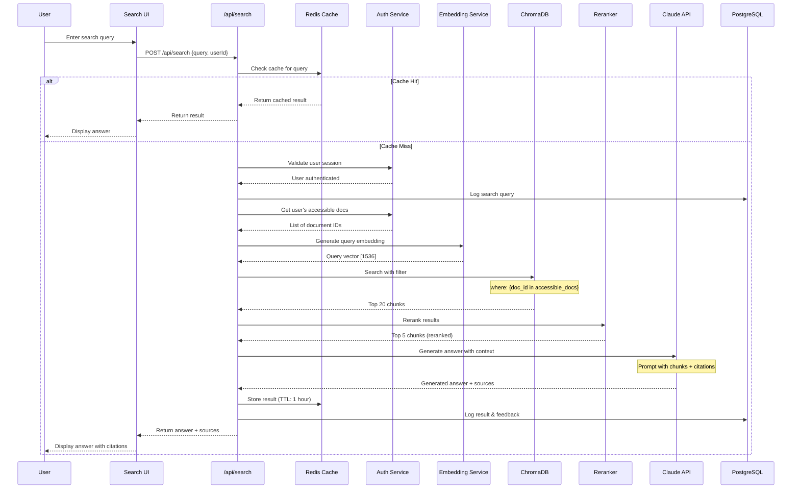
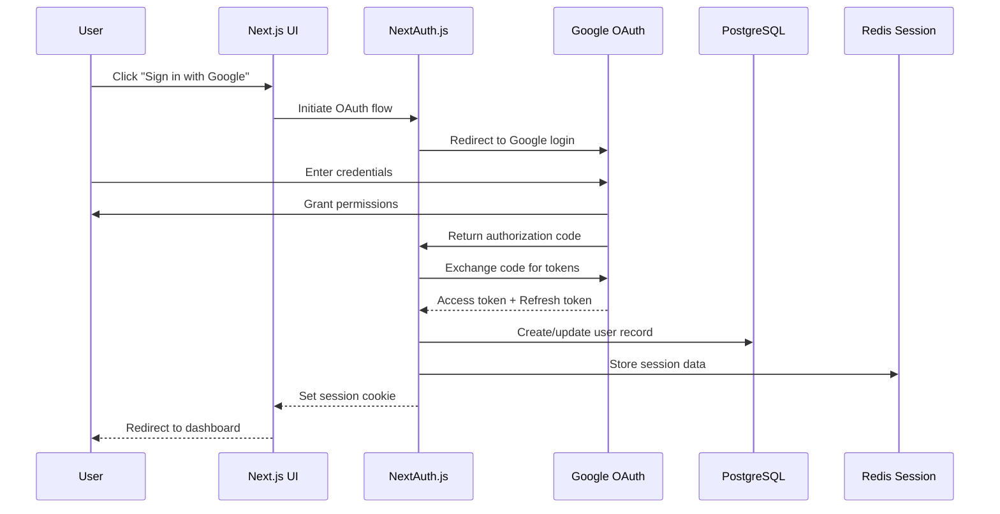
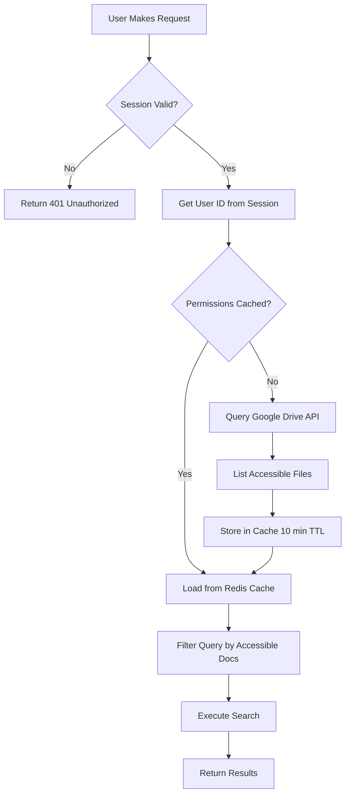
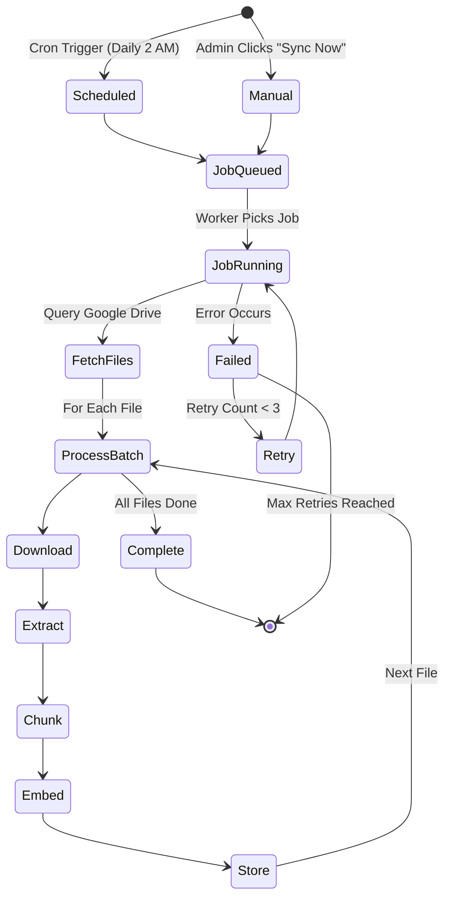
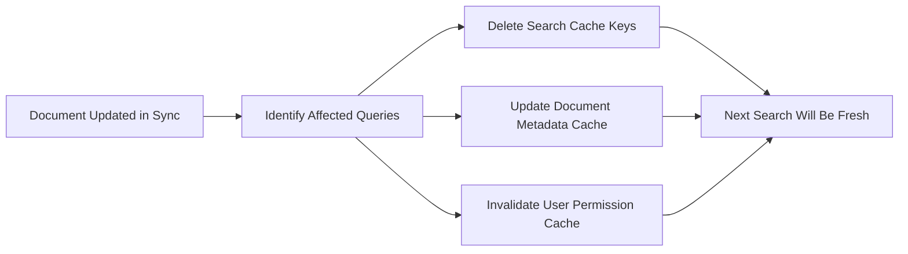
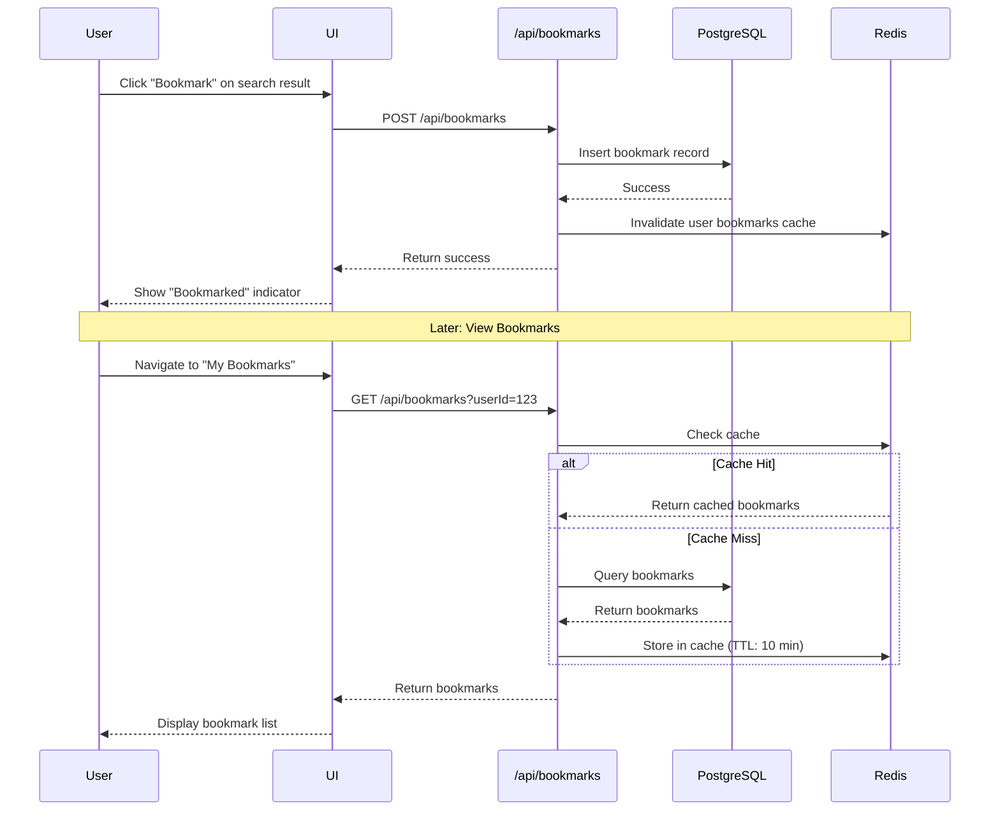

# RAG System - Detailed Data Flow Diagrams

## Table of Contents
1. [Document Ingestion Flow](#1-document-ingestion-flow)
2. [Search Query Flow](#2-search-query-flow)
3. [User Authentication Flow](#3-user-authentication-flow)
4. [Permission Validation Flow](#4-permission-validation-flow)
5. [Background Sync Flow](#5-background-sync-flow)
6. [Caching Strategy Flow](#6-caching-strategy-flow)
7. [Answer Generation Flow](#7-answer-generation-flow)
8. [Bookmark & History Flow](#8-bookmark--history-flow)

---

## 1. Document Ingestion Flow

### Overview
Process of fetching documents from Google Drive, processing them, and storing embeddings.



### Detailed Step-by-Step Flow

```
┌─────────────────────────────────────────────────────────────────┐
│ STEP 1: Trigger Sync                                            │
└─────────────────────────────────────────────────────────────────┘
  Input: Manual trigger or scheduled cron
  Output: Job ID in queue

  Admin Dashboard → API Route → Create Job → Add to Queue

┌─────────────────────────────────────────────────────────────────┐
│ STEP 2: Fetch Files from Google Drive                          │
└─────────────────────────────────────────────────────────────────┘
  Query: Files modified since last_sync_timestamp
  API Call: drive.files.list({
    q: "modifiedTime > '2025-11-07T00:00:00'",
    fields: "files(id, name, mimeType, modifiedTime, owners)"
  })

  Output: Array of file metadata

┌─────────────────────────────────────────────────────────────────┐
│ STEP 3: Download & Extract Text                                │
└─────────────────────────────────────────────────────────────────┘
  For each file:
    3.1: Download file content
         drive.files.get({fileId, alt: 'media'})

    3.2: Detect file type (PDF, DOCX, Google Docs, etc.)

    3.3: Extract text
         PDF → pdf-parse library
         DOCX → mammoth library
         Google Docs → Drive API export as text

    3.4: Clean text (remove special chars, normalize whitespace)

  Output: Plain text string

┌─────────────────────────────────────────────────────────────────┐
│ STEP 4: Chunk Text                                             │
└─────────────────────────────────────────────────────────────────┘
  Strategy: RecursiveCharacterTextSplitter

  Parameters:
    chunk_size: 1024 tokens (~750 words)
    chunk_overlap: 100 tokens
    separators: ["\n\n", "\n", ". ", " ", ""]

  For each document:
    chunks = splitter.split_text(document_text)

  Metadata added to each chunk:
    - document_id
    - chunk_index
    - document_title
    - file_path
    - author
    - created_date

  Output: Array of chunks with metadata

┌─────────────────────────────────────────────────────────────────┐
│ STEP 5: Generate Embeddings                                    │
└─────────────────────────────────────────────────────────────────┘
  Service: OpenAI text-embedding-3-large (or Cohere)

  Batch processing (100 chunks at a time):
    embeddings = await openai.embeddings.create({
      model: "text-embedding-3-large",
      input: chunk_texts,
      dimensions: 1536
    })

  Output: Array of 1536-dimensional vectors

┌─────────────────────────────────────────────────────────────────┐
│ STEP 6: Store in ChromaDB                                      │
└─────────────────────────────────────────────────────────────────┘
  collection.add(
    ids: [chunk_ids],
    embeddings: [vectors],
    metadatas: [chunk_metadata],
    documents: [chunk_texts]
  )

┌─────────────────────────────────────────────────────────────────┐
│ STEP 7: Store Metadata in PostgreSQL                           │
└─────────────────────────────────────────────────────────────────┘
  await prisma.document.upsert({
    where: { driveId: file.id },
    create: {
      driveId: file.id,
      title: file.name,
      path: file.path,
      fileType: file.mimeType,
      sizeBytes: file.size,
      author: file.owner,
      createdAt: file.createdTime,
      modifiedAt: file.modifiedTime,
      lastSynced: new Date(),
      chunkCount: chunks.length,
      permissions: file.permissions
    }
  })

┌─────────────────────────────────────────────────────────────────┐
│ STEP 8: Backup to S3                                           │
└─────────────────────────────────────────────────────────────────┘
  s3.putObject({
    Bucket: 'rag-embeddings-backup',
    Key: `embeddings/${document_id}.json`,
    Body: JSON.stringify(embeddings)
  })
```

---

## 2. Search Query Flow

### Sequence Diagram



### Detailed Flow

```
┌─────────────────────────────────────────────────────────────────┐
│ STEP 1: User Input & Validation                                │
└─────────────────────────────────────────────────────────────────┘
  User types: "How do I implement OAuth authentication?"

  Frontend validation:
    - Min length: 3 characters
    - Max length: 500 characters
    - Rate limit check (10 queries/minute)

  API Request:
    POST /api/search
    {
      "query": "How do I implement OAuth authentication?",
      "userId": "user_123",
      "filters": {
        "fileTypes": ["pdf", "md"],
        "dateRange": "last_year"
      }
    }

┌─────────────────────────────────────────────────────────────────┐
│ STEP 2: Cache Check                                            │
└─────────────────────────────────────────────────────────────────┘
  Cache Key: `search:${hash(query + filters)}`

  const cached = await redis.get(cacheKey)
  if (cached) {
    return JSON.parse(cached)
  }

  Cache TTL: 1 hour for popular queries

┌─────────────────────────────────────────────────────────────────┐
│ STEP 3: Authentication & Permission Check                      │
└─────────────────────────────────────────────────────────────────┘
  3.1: Validate user session
       const session = await getServerSession()
       if (!session) throw new UnauthorizedError()

  3.2: Get user's Google Drive access token
       const token = await getAccessToken(userId)

  3.3: Query accessible documents
       Option A: From cache (updated every 10 minutes)
       Option B: Real-time query to Drive API

       const accessibleDocs = await getAccessibleDocuments(userId)
       // Returns: ["doc_123", "doc_456", ...]

┌─────────────────────────────────────────────────────────────────┐
│ STEP 4: Query Embedding                                        │
└─────────────────────────────────────────────────────────────────┘
  const embedding = await openai.embeddings.create({
    model: "text-embedding-3-large",
    input: query,
    dimensions: 1536
  })

  queryVector = embedding.data[0].embedding
  // [0.123, -0.456, 0.789, ..., 0.321] (1536 dimensions)

┌─────────────────────────────────────────────────────────────────┐
│ STEP 5: Vector Search in ChromaDB                              │
└─────────────────────────────────────────────────────────────────┘
  const results = await collection.query({
    queryEmbeddings: [queryVector],
    nResults: 20,
    where: {
      "document_id": { "$in": accessibleDocs }
    },
    include: ["embeddings", "metadatas", "documents", "distances"]
  })

  Results structure:
  [
    {
      id: "chunk_789",
      distance: 0.23,  // Lower = more similar
      metadata: {
        document_id: "doc_123",
        document_title: "OAuth Implementation Guide",
        chunk_index: 5,
        file_path: "/docs/auth/oauth.md"
      },
      document: "To implement OAuth, first register..."
    },
    // ... 19 more results
  ]

┌─────────────────────────────────────────────────────────────────┐
│ STEP 6: Reranking (Optional but Recommended)                   │
└─────────────────────────────────────────────────────────────────┘
  Purpose: Improve relevance beyond just vector similarity

  Service: Cohere Rerank API

  const reranked = await cohere.rerank({
    model: "rerank-english-v2.0",
    query: query,
    documents: results.map(r => r.document),
    top_n: 5
  })

  Output: Top 5 most relevant chunks

┌─────────────────────────────────────────────────────────────────┐
│ STEP 7: Context Assembly                                       │
└─────────────────────────────────────────────────────────────────┘
  Build context from top chunks:

  const context = reranked.map((chunk, idx) => {
    return `
    [Source ${idx + 1}: ${chunk.metadata.document_title}]
    ${chunk.document}
    `
  }).join('\n\n')

┌─────────────────────────────────────────────────────────────────┐
│ STEP 8: Prompt Construction for Claude                         │
└─────────────────────────────────────────────────────────────────┘
  const systemPrompt = `You are a helpful AI assistant that answers
  questions based on the company's internal documentation. Always cite
  your sources using the [Source N] format. If you cannot answer based
  on the provided context, say so clearly.`

  const userPrompt = `
  Context from company documents:
  ${context}

  User question: ${query}

  Instructions:
  1. Provide a clear, concise answer
  2. Include citations [Source N] for each claim
  3. If information is incomplete, mention what's missing
  4. Use bullet points or numbered lists when appropriate
  `

┌─────────────────────────────────────────────────────────────────┐
│ STEP 9: Generate Answer with Claude                            │
└─────────────────────────────────────────────────────────────────┘
  const response = await anthropic.messages.create({
    model: "claude-3-5-sonnet-20241022",
    max_tokens: 1024,
    system: systemPrompt,
    messages: [
      { role: "user", content: userPrompt }
    ]
  })

  answer = response.content[0].text

  Example output:
  "To implement OAuth authentication, follow these steps:

  1. Register your application with the OAuth provider [Source 1]
  2. Configure redirect URIs in your app settings [Source 2]
  3. Implement the authorization flow... [Source 1]

  For detailed code examples, see the OAuth Implementation Guide [Source 1]."

┌─────────────────────────────────────────────────────────────────┐
│ STEP 10: Post-Processing & Response                            │
└─────────────────────────────────────────────────────────────────┘
  10.1: Extract citations and map to documents
        const citations = extractCitations(answer)
        const sources = citations.map(c => ({
          title: chunks[c.index].metadata.document_title,
          path: chunks[c.index].metadata.file_path,
          excerpt: chunks[c.index].document.substring(0, 200)
        }))

  10.2: Calculate confidence score
        confidence = calculateConfidence(chunks, answer)

  10.3: Format final response
        const response = {
          answer: answer,
          sources: sources,
          confidence: confidence,
          query: query,
          timestamp: new Date()
        }

  10.4: Cache result
        await redis.setex(cacheKey, 3600, JSON.stringify(response))

  10.5: Log to database
        await prisma.searchHistory.create({
          data: {
            userId,
            query,
            answer,
            confidence,
            sourceCount: sources.length
          }
        })

  10.6: Return to frontend
        return response
```

---

## 3. User Authentication Flow



### Session Management

```
┌─────────────────────────────────────────────────────────────────┐
│ Session Storage (Redis)                                        │
└─────────────────────────────────────────────────────────────────┘
  Key: `session:${sessionId}`
  Value: {
    userId: "user_123",
    email: "user@company.com",
    googleAccessToken: "ya29.a0...",
    googleRefreshToken: "1//0g...",
    tokenExpiry: 1699564800,
    drivePermissions: [...],
    lastActivity: 1699561200
  }
  TTL: 7 days (extended on each request)

┌─────────────────────────────────────────────────────────────────┐
│ Token Refresh Flow                                             │
└─────────────────────────────────────────────────────────────────┘
  if (session.tokenExpiry < Date.now()) {
    const newToken = await refreshGoogleToken(session.googleRefreshToken)
    session.googleAccessToken = newToken.access_token
    session.tokenExpiry = Date.now() + newToken.expires_in
    await redis.set(sessionKey, JSON.stringify(session))
  }
```

---

## 4. Permission Validation Flow



### Permission Check Implementation

```typescript
// Pseudocode for permission enforcement

async function getAccessibleDocuments(userId: string): Promise<string[]> {
  // 1. Check cache first
  const cacheKey = `user_permissions:${userId}`
  const cached = await redis.get(cacheKey)

  if (cached) {
    return JSON.parse(cached)
  }

  // 2. Query Google Drive API
  const session = await getSession(userId)
  const drive = google.drive({ version: 'v3', auth: session.googleAccessToken })

  const response = await drive.files.list({
    q: "trashed = false",
    fields: "files(id, name, permissions)",
    pageSize: 1000
  })

  // 3. Extract document IDs user can access
  const accessibleDocs = response.data.files.map(file => file.id)

  // 4. Cache for 10 minutes
  await redis.setex(cacheKey, 600, JSON.stringify(accessibleDocs))

  return accessibleDocs
}

// Usage in search
async function search(query: string, userId: string) {
  const accessibleDocs = await getAccessibleDocuments(userId)

  const results = await chromaDB.query({
    queryEmbeddings: [embedding],
    where: {
      "document_id": { "$in": accessibleDocs }  // <-- Filter here
    }
  })

  return results
}
```

---

## 5. Background Sync Flow



### Sync Job State Management

```
┌─────────────────────────────────────────────────────────────────┐
│ SyncJob Table (PostgreSQL)                                     │
└─────────────────────────────────────────────────────────────────┘
  {
    id: "job_abc123",
    status: "running",  // pending, running, completed, failed
    startedAt: "2025-11-08T02:00:00Z",
    completedAt: null,
    totalDocuments: 150,
    processedDocuments: 45,
    failedDocuments: 2,
    lastError: null,
    retryCount: 0,
    metadata: {
      documentsAdded: 10,
      documentsUpdated: 30,
      documentsDeleted: 5
    }
  }

┌─────────────────────────────────────────────────────────────────┐
│ Real-time Progress Updates (WebSocket)                         │
└─────────────────────────────────────────────────────────────────┘
  Worker emits events:
    - progress: { processed: 45, total: 150, percent: 30 }
    - document_processed: { documentId, title, status }
    - error: { documentId, error }
    - completed: { totalProcessed, duration }

  Admin dashboard subscribes to these events and updates UI in real-time
```

---

## 6. Caching Strategy Flow

```
┌─────────────────────────────────────────────────────────────────┐
│ Multi-Layer Caching Strategy                                   │
└─────────────────────────────────────────────────────────────────┘

Layer 1: Browser Cache (Next.js)
  - Static assets: 1 year
  - Server components: Automatic

Layer 2: CDN Cache (CloudFront)
  - Public pages: 1 hour
  - API responses: No cache

Layer 3: Application Cache (Redis)
  ┌──────────────────────┬──────────┬─────────────────┐
  │ Cache Type           │ TTL      │ Invalidation    │
  ├──────────────────────┼──────────┼─────────────────┤
  │ Search results       │ 1 hour   │ On doc update   │
  │ User permissions     │ 10 min   │ On token refresh│
  │ Document metadata    │ 1 day    │ On sync         │
  │ Popular queries      │ 4 hours  │ Manual          │
  │ User sessions        │ 7 days   │ On logout       │
  │ Embedding results    │ 1 day    │ Never           │
  └──────────────────────┴──────────┴─────────────────┘

Layer 4: Database Query Cache (Prisma)
  - Automatic query result caching
  - Cleared on writes
```

### Cache Invalidation Flow



---

## 7. Answer Generation Flow

```
┌─────────────────────────────────────────────────────────────────┐
│ Detailed Answer Generation Pipeline                            │
└─────────────────────────────────────────────────────────────────┘

Input: User Query + Retrieved Chunks

STEP 1: Context Preparation
  ├─ Deduplicate chunks from same document
  ├─ Sort by relevance score
  ├─ Truncate to fit in context window (180k tokens for Claude)
  └─ Format with source markers

STEP 2: Prompt Engineering
  ├─ System Prompt: Define AI role and behavior
  ├─ Few-shot Examples: Show desired output format
  ├─ Context: Insert retrieved chunks
  ├─ User Query: Original question
  └─ Instructions: Citation format, tone, length

STEP 3: Claude API Call
  ├─ Model: claude-3-5-sonnet-20241022
  ├─ Max Tokens: 1024
  ├─ Temperature: 0.3 (more focused)
  └─ Stop Sequences: ["</answer>"]

STEP 4: Response Processing
  ├─ Parse citations
  ├─ Validate sources exist
  ├─ Format markdown
  ├─ Add confidence score
  └─ Truncate if needed

STEP 5: Quality Checks
  ├─ Hallucination detection
  ├─ Citation coverage
  ├─ Answer relevance
  └─ Tone/safety check

Output: Formatted Answer + Sources + Metadata
```

### Prompt Template

````markdown
System Prompt:
You are an AI assistant helping employees find information from internal
company documentation. You must:
1. Only use information from the provided context
2. Always cite sources using [Source N] format
3. Be concise but thorough
4. If context is insufficient, say so clearly
5. Use professional tone

Context:
---
[Source 1: OAuth Implementation Guide - /docs/auth/oauth.md]
To implement OAuth 2.0, first register your application with the provider...

[Source 2: Security Best Practices - /docs/security/auth.md]
When implementing authentication, always use HTTPS and validate redirect URIs...

[Source 3: Code Examples - /examples/auth/oauth-example.ts]
```typescript
const oauth = new OAuth2Client(clientId, clientSecret, redirectUri)
```
---

User Question: How do I implement OAuth authentication?

Instructions:
- Provide a step-by-step answer
- Include code examples if available
- Cite each claim with [Source N]
- Highlight any security considerations
- Suggest related documents if relevant
````

---

## 8. Bookmark & History Flow



### Database Schema

```sql
-- Search History
CREATE TABLE search_history (
  id VARCHAR(255) PRIMARY KEY,
  user_id VARCHAR(255) NOT NULL,
  query TEXT NOT NULL,
  answer TEXT,
  confidence DECIMAL(3,2),
  source_count INTEGER,
  feedback VARCHAR(50), -- helpful, not_helpful, null
  created_at TIMESTAMP DEFAULT NOW(),
  INDEX idx_user_created (user_id, created_at DESC)
);

-- Bookmarks
CREATE TABLE bookmarks (
  id VARCHAR(255) PRIMARY KEY,
  user_id VARCHAR(255) NOT NULL,
  document_id VARCHAR(255) NOT NULL,
  chunk_id VARCHAR(255),
  note TEXT,
  tags TEXT[], -- PostgreSQL array
  created_at TIMESTAMP DEFAULT NOW(),
  UNIQUE(user_id, document_id, chunk_id),
  INDEX idx_user_created (user_id, created_at DESC)
);

-- User Feedback
CREATE TABLE search_feedback (
  id VARCHAR(255) PRIMARY KEY,
  search_history_id VARCHAR(255) REFERENCES search_history(id),
  user_id VARCHAR(255) NOT NULL,
  rating INTEGER CHECK (rating >= 1 AND rating <= 5),
  comment TEXT,
  issue_type VARCHAR(50), -- irrelevant, incorrect, incomplete
  created_at TIMESTAMP DEFAULT NOW()
);
```

---

## Summary: Complete Request Lifecycle

```
┌─────────────────────────────────────────────────────────────────┐
│ Complete User Search Request Flow                              │
└─────────────────────────────────────────────────────────────────┘

1. User Input
   ↓
2. Frontend Validation
   ↓
3. API Request → /api/search
   ↓
4. Authentication Check (NextAuth + Redis Session)
   ↓
5. Authorization (Get accessible documents)
   ↓
6. Cache Check (Redis)
   ├─ Hit: Return cached result ✓
   └─ Miss: Continue ↓
7. Query Embedding (OpenAI API)
   ↓
8. Vector Search (ChromaDB) with permission filter
   ↓
9. Reranking (Cohere API)
   ↓
10. Context Assembly
   ↓
11. Answer Generation (Claude API)
   ↓
12. Post-processing (Citations, formatting)
   ↓
13. Cache Result (Redis)
   ↓
14. Log to Database (PostgreSQL)
   ↓
15. Return to Frontend
   ↓
16. Display to User with Sources

Performance Targets:
├─ Total latency: < 2 seconds (p95)
├─ Cache hit rate: > 80%
├─ Embedding generation: < 100ms
├─ Vector search: < 200ms
├─ LLM generation: < 1.5 seconds
└─ Database operations: < 50ms
```

---

## Performance Optimization Flow

```
┌─────────────────────────────────────────────────────────────────┐
│ Request Optimization Strategies                                │
└─────────────────────────────────────────────────────────────────┘

Parallel Processing:
  ┌─────────────────┐
  │ User Query      │
  └────────┬────────┘
           │
    ┌──────┴──────┬───────────┬──────────┐
    ▼             ▼           ▼          ▼
  ┌────┐      ┌────┐      ┌────┐    ┌────┐
  │Auth│      │Embed│     │Cache│   │ Log│
  └─┬──┘      └──┬─┘      └──┬─┘    └──┬─┘
    │            │           │          │
    └────────────┴───────────┴──────────┘
                 │
          Continue pipeline

Batch Operations:
  - Embedding: 100 chunks at once
  - Database inserts: Batch 500 records
  - ChromaDB upsert: 100 vectors per call

Streaming Response:
  User ← UI ← Server-Sent Events ← Claude API
  (Stream answer as it's generated)

Connection Pooling:
  - PostgreSQL: 20 connections
  - Redis: 10 connections
  - HTTP Keep-Alive for APIs
```

---

**Key Takeaways:**

1. **Multi-layer caching** reduces latency from ~2s to ~50ms for repeated queries
2. **Permission filtering** happens at the vector DB level for security
3. **Background jobs** handle expensive operations asynchronously
4. **Parallel processing** where possible (auth + embedding + logging)
5. **Graceful degradation**: Cache fallbacks, retry logic, error handling
6. **Observability**: Every step is logged and monitored

